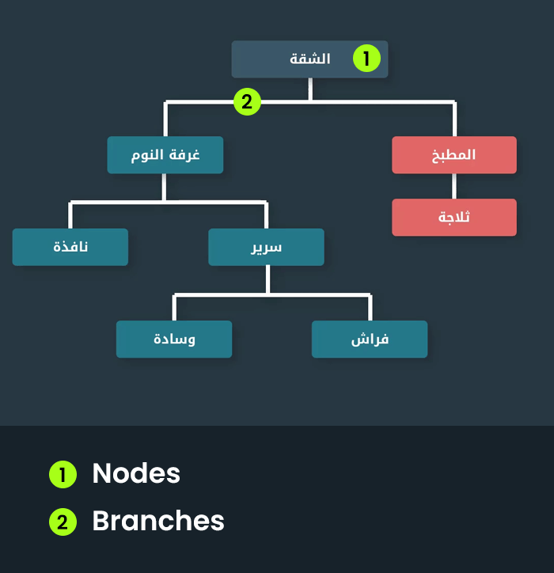
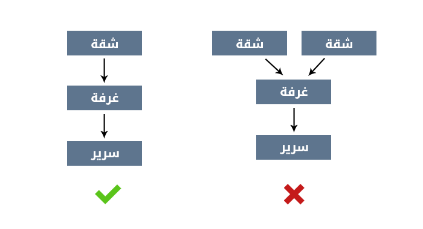
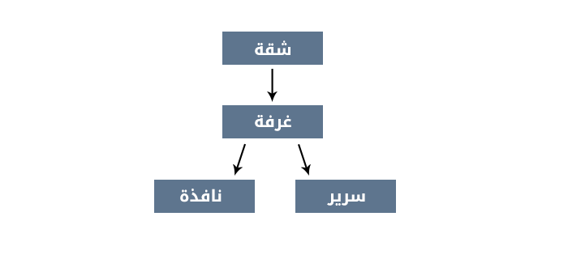
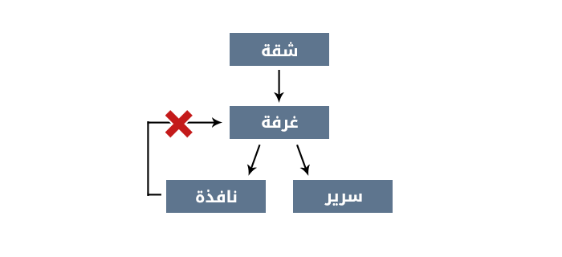

حتى نعرف كيف يتم **تطبيق التنسيقات** على العناصر وما الذي نعنية **بالتتابع** في لغة الـ **CSS** يجب أولاً أن نفهم **شجرة الـ DOM**.

## مكونات الشجرة

1- **الـ Nodes**:
هي العناصر التي يتم تمثليها في الشجرة.

2- **الـ Branches**:
تلك الـ nodes ترتبط ببعضها البعض من خلال فروع، هذه الفروع هي ما يطلق عليه بالـ Branches.

 

## قواعد الشجر:
هناك ثلاث قواعد أساسية يجب أن تتحقق في الشجرة وهي كالتالي:

**1- لابد من أن تبدأ الشجرة بـ Node واحدة ويطلق عليها إسم جذر الشجرة (The root).**

 

**2- بإمكان أي Node التفرع لا عدد من الـ Nodes حيث يطلق على الـ nodes الفرعية بالأبناء (Children)** 
 

**3- كل Node بإمكانها الحصول على أب واحد فقط، أما الـ Root فليس له أي أب.**

 

في الصورة أعلاة هناك سهمين متوجهان للـ **غرفة** ما يوحي بأن هذه الـ Node لديها أثنين أباء، ذلك غير صحيح يجب أن يكون عدد الأسهم المتوجهة لأي Node في الشجرة **واحد** فقط.

في الوقت نفسة بالإمكان أن يخرج من هذه الـ Node أي عدد من الأسهم بإتجاه الأبناء.

---

بهذا نكون وصلنا إلى نهاية هذا الدرس.

