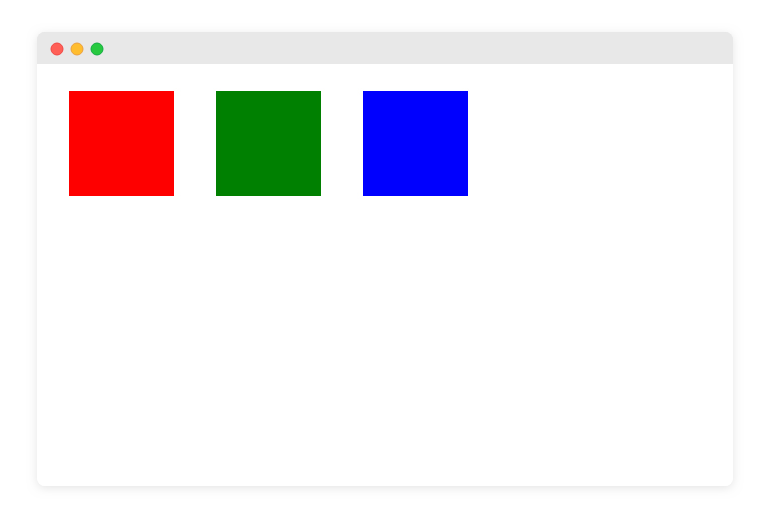

### في هذا التحدي سيكون المطلوب الوصول للنتيجة التالية:
 


### الخطوات المطلوب منك القيام بها:

#### 1- إنشاء ملف المشروع
ستقوم بإنشاء ملف HTML جديد على جهاز الكمبيوتر الخاص بك، كما قمنا بذلك في ورشة عمل بيئة العمل المحلية.

#### 2- إضافة عناصر `div` للصفحة
  ستقوم بإضافة 3 عناصر من النوع `div` في الصفحة. لا داعي لأن تقوم بكتابة أي نص بداخل العناصر دعها فارغة. كالتالي:

```
<div></div>
<div></div>
<div></div>
```


#### 3- إضافة التنسيقات اللازمة

- ستقوم بإستهداف جميع العناصر التي من النوع `div` وإعطائها تنسيقات عاملة كعرض وإتفاع محدد وكذلك هوامش خارجية وأيضاً تجعلها تصطف في سطر واحد بدلاً من أن يأخذ كل `div` السطر كاملاً.

- ستقوم بإعطاء كل عنصر مُعرف `id` ومن ثم تقوم بإستهداف العنصر من خلال ذلك المعرف وتقوم بإعطائه لون خلفية مختلف حيث الصندوق الأول سيكون لونه <span style="color:red;">red</span> والثاني <span style="color:green;">green</span> والثالث <span style="color:blue;">blue</span>.

---

بمجرد ما إن تنتهي من تطبيق ذلك وتتأكد من أنك وصلت للنتيجة المطلوبة قم بتسليم الأكواد من خلال الرابط التالي:

<a href="https://forums.coretabs.net/t/تسليم-حلول-مهمة-التدرب-على-الـ-id/1915" class="task-btn">تسليم الحلول</a>

تذكر بأن تطلب المساعدة مني أو من أي احد من الزملاء في حال إحتجت لذلك.