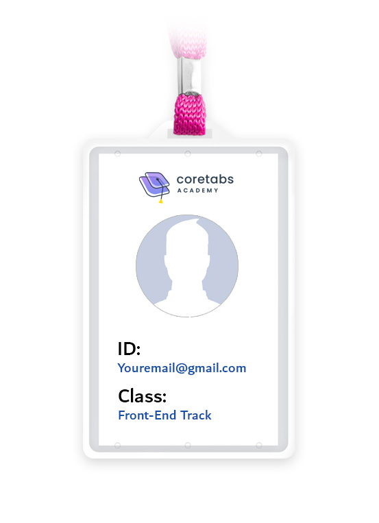
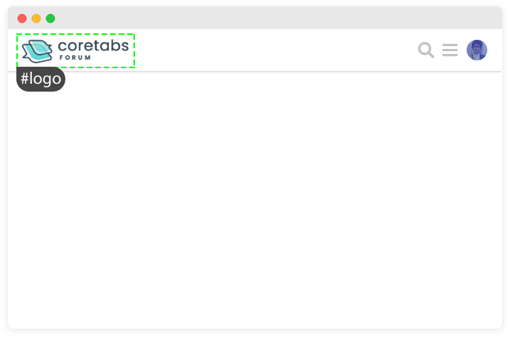
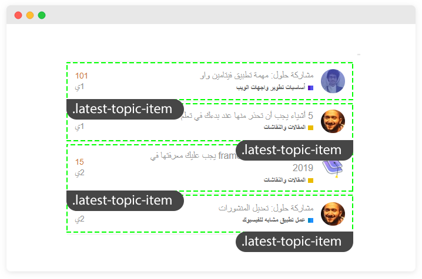

## عضويتنا على الأكاديمية

**حتى نقوم بتجميع الأفكار في هذه الوحدة تخيل معي السيناريو التالي:**


أنا وأنت في كورتابز لدينا **عضوية**، ولدينا شيئين يميزاننا من بين جميع الأعضاء وهي كالتالي:

1- لدى كلاً مننا شئ مميز لا يستطيع أي عضو أخر الحصول عليه وهو **البريد الإلكتروني** الذي قمنا بالتسجيل به.

2- لدى كلاً مننا شئ مميز يتشاركة مع مجموعة من الأعضاء وهو أننا جميعاً في **مسار تطوير واجهات الويب**.

 


هذا يوحي لنا بأنه إذا ما أردت أن أقوم بالتأثير على حسابك فأستطيع الوصول إليك من خلال تلك الطريقتين كالتالي:

### الطريقة الأولى: عبر إيميلك الشخصي:
 إذا ما أعطيتني إيميلك الشخصي فسأستطيع الوصول إليك أنت وحدك مباشرة والتأثير على عضويتك بطريقة أو بأخرى.
> تلاحظ أن أيميلك الشخصي لا يمكن لأحد أن يستخدمة فهو يخصك أنت وحدك، أي أنه يتصرف كالـ ID.

### الطريقة الثانية: عبر المجموعة التي إخترت الإنضمام لها:
أنت كعضو في الأكاديمية تم ضمَك لمجموعة مسار تطوير واجهات الويب فاذا انا ما قمت بالتأثير والتعديل على هذه المجموعة فعضويتك ستتأثر كذلك.
> تلاحظ أن هذه المجموعة أنت تشاركها مع بقية الأعضاء وليست شئ خاص بك وحدك والتعديل عليها يؤثر عليكم جميعاً، أي ان المجموعة هذه تتصرف كالـ Class.

---

## هل بإمكاني أن أعُطي العنصر `id` و `class` في نفس الوقت؟

أرجع لمثالنا عن عضويتك بهذا المجتمع هل تمتلك id و class بنفس الوقت ؟
اذا فالوضع ليس مختلف عن هذا

**مثال:**
```html
<p id="my-id" class="my-class">Hello world!</p>
```

---

## كيف أعرف متى أقوم بأستخدام `id` أو `class` مع العنصر؟

لا تشغل بالك بهذا السؤال، إجابته تأتيك مع الممارسة و الوقت ولكن خلي في بالك بأن الـ  id يتم إستخدامه مع العنصر المميز الذي لا يتكرر في الصفحة بينما الـ class  نقوم بإسنادة للعناصر التي قد تتكرر في الصفحة. 


**مثال-1:**

 

> في الصورة أعلاة قمت بإعطاء الشعار `id` بإسم `logo`، فلماذا إخترت إعطائه `id`؟

قررت إعطاء ذلك العنصر `id` لأنه عنصر فريد من نوعة في الصفحة فالشعار سيكون عنصر واحد فقط في منطقة الـ `header` ولا أظن بأنني أريد تكرارة في مكان أخر بنفس الصفحة.

> لكن ذلك لا يعني بأنه لا يمكنك إعطاء الشعار `class` بدلاً من الـ `id` ذلك راجع إليك.

**مثال-2:**

  

> في الصورة أعلاة قائمة بأخر المواضيع المطروحة في منصة المجتمع، قمت بإعطاء كلاً منها `class` بإسم `latest-topic-items` فلماذا إخترت إعطائها `class`؟

قررت إعطاء تلك العناصر `class` وذلك لأنه لدي مجموعة منها متكررة في الصفحة ونريد منها أن تتشارك نفس التنسيقات.
