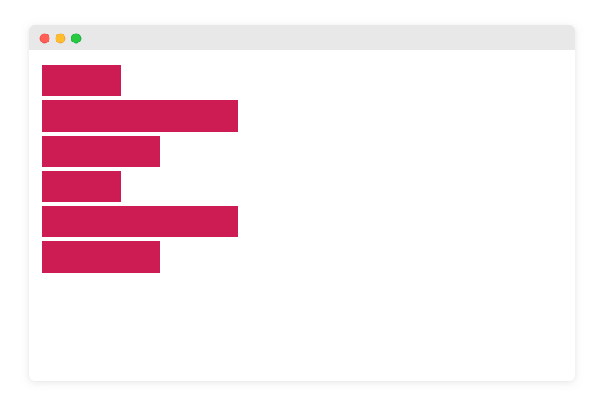

في هذا التحدي نريد أن نقوم بإنشاء مجموعة صناديق نستطيع التحكم في عرضها بالقياسات التالية:

`s` `m` `l` 

### حيث أن 

- `s` يرمز إلى `Small` ويقوم بإعطاء الصندوق عرض بقيمة `100px`
- `m` يرمز إلى `Medium` ويقوم بإعطاء الصندوق عرض بقيمة `150px`
- `l` يرمز إلى `Large` ويقوم بإعطاء الصندوق عرض بقيمة `250px`


## مطلوب منك الوصول للنتيجة التالية: 
  

## الخطوات المطلوب منك القيام بها: 

### 1- إنشاء ملف المشروع
ستقوم بإنشاء ملف HTML جديد على جهاز الكمبيوتر الخاص بك.

### 2- إضافة عناصر div للصفحة:
ستقوم بإضافة على الأقل 6 عناصر من النوع `div` في الصفحة. لا داعي لأن تقوم بكتابة أي نص بداخل العناصر دعها فارغة. كالتالي:

```html
<div></div>
<div></div>
<div></div>
<div></div>
<div></div>
<div></div>
```

### 3- كل عنصر عبارة عن box:
إعتبر أن كل عنصر عبارة عن صندوق وقم بإسناد هذا الإسم له كـ `class` ومن ثم قم بإستهدافة وإعطائه التنسيقات اللازمة كالإرتفاع، العرض ،لون للخلفية والهوامش وما خلافة حسب ما تراه مناسب.

> هذه المرة ستترك كل `div` يأخذ العرض كاملاً كـ block element

### 4- كل box يجب أن يكون لدية حجم محدد:
بعد إنتهائك من إعطاء الصناديق التنسيقات العامة من خلال الكلاس `.box` قم بتوزيع الأحجام عليها بإسناد الكلاسات `s` `m` `l` بشكل عشوائي لتحصل على ما يقارب او يطابق النتيجة الموضحة في الصورة أعلاة.

> تذكر أنك ستقوم بإستخدام كلاسات متعددة لكل عنصر كما قمنا في الدرس السابق.

<a href="https://forums.coretabs.net/t/تسليم-حلول-مهمة-التدرب-على-الكلاسات-المتعددة/1942" class="task-btn">تسليم الحلول</a>


<details>
  <summary style="cursor:pointer;">تلميح: لا تفتحة إلا إذا كنت بحاجته</summary>
  <div style="padding: 10px; background: rgb(157,214,46); background: linear-gradient(70deg, rgba(157,214,46,1) 0%, rgba(73,222,110,1) 100%); color: #000; border-radius: 8px;">
  للحصول على صندوق بعرض صغير ستقوم بإسناد الكلاس box و الكلاس s للعنصر div
  </div>
</details>

---

في حال إحتجت إلى أي مساعدة أو توضيح لا تتردد في طلبها مني او من أحد الزملاء.