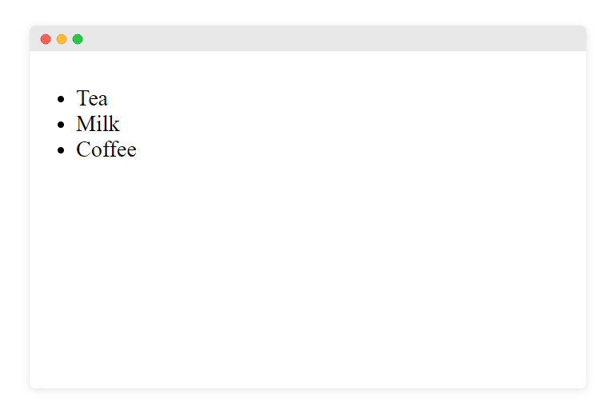
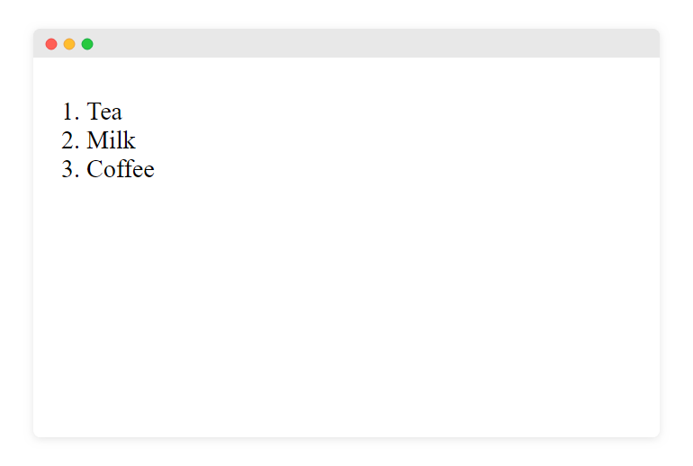
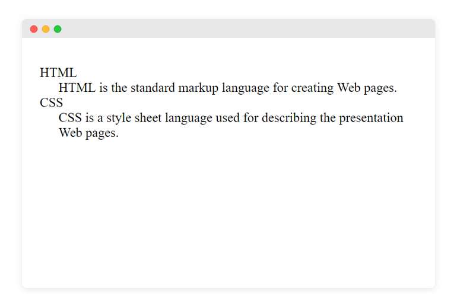

في لغة الـ HTML لدينا ثلاثة أنواع للقوائم (Lists)

## 1- قوائم غير مرتبة (Unordered Lists):

نقوم بتعريفها بإستخدام العنصر `ul`.

**مثال:**
```html
<ul></ul>
```

### يتم إضافة عناصر لهذه القائمة بإستخدام العنصر `li`.

**مثال:**
```html
<ul>
    <li>Tea</li>
    <li>Milk</li>
    <li>Coffee</li>
</ul>
```

**النتيجة:**
 

---

## 2- قوائم مرتبة (Ordered Lists):

نقوم بتعريفها بإستخدام العنصر `ol`.

**مثال:**
```html
<ol></ol>
```

### يتم إضافة عناصر لهذه القائمة بإستخدام العنصر `li`.

**مثال:**
```html
<ol>
    <li>Tea</li>
    <li>Milk</li>
    <li>Coffee</li>
</ol>
```

**النتيجة:**
 


---

## 3- قوائم الوصف (Description Lists):
نستخدم هذا النوع من القوائم لإضافة قائمة لمجموعة من المصطلحات وتعاريفها على سبيل المثال.

نقوم بتعريفها بإستخدام العنصر `dl`.

**مثال:**
```html
<dl></dl>
```

نقوم بإضافة المصطلح المراد وصفة بالعنصر `dt`

ومن ثم نقوم بإضافة الوصف الخاص به بالعنصر `dd`

مثال:

```html
<dl>
    <dt>HTML</dt>
    <dd>HTML is the standard markup language for creating Web pages. </dd>

    <dt>CSS</dt>
    <dd>CSS is a style sheet language used for describing the presentation Web pages. </dd>
</dl>
```

**النتيجة:**

 

