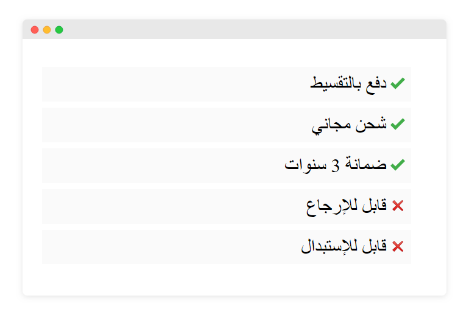

في هذا التحدي سنقوم بإنشاء قائمة تستعرض مميزات وشروط أحد العروض.

## المطلوب منك الوصول للنتيجة التالية:

### موقع الأيقونات:

[https://iconfinder.com](https://iconfinder.com)

**إسم الأيقونة الأولى:** check
**إسم الأيقونة الثانية:** delete

إشعر بحرية لإستخدام أي أيقونات أخرى.

---

## خطوات العمل:

**1- إنشاء القائمة بالعناصر المطلوبة.**
قرر أي نوع من القوائم هو المناسب لهذه القائمة، `ul` أم `ol` وقم بإنشاء هيكلها.

**2- قم بإضافة التنسيقات على القائمة وعناصرها بشكل تدريجي.**
لا تشغل بالك بالوصول للنتيجة النهائية و إضافة صور الايقونات المختلفة للعناصر في البدأية، قم أولاً بتضبيط تنسيقات القائمة بإعطائها اللازم كلون الخلفية، الحواشي والهوامش. وما إن كنت تريد وضع علامات التنقيط بداخل العناصر ام بخارجها.

ومن ثم قم بالإهتمام بالأيقونات وإضافة أيقونات مختلفة للعناصر حسب المطلوب.

<a href="https://forums.coretabs.net/t/مهمة-التدرب-على-تنسيقات-القوائم/1977" class="task-btn">تسليم الحلول</a>