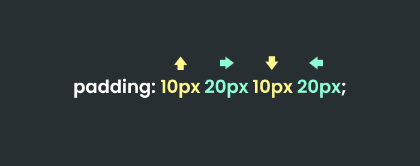
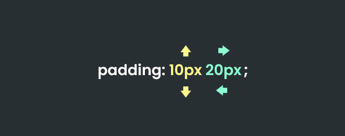

## إزالة التنسيقات الإفتراضية للقوائم:
غالباً ما ستحتاج لإزالة التنسيقات الإفتراضية للقوائم، ولتحقيق ذلك نقوم بعمل إعادة ضبط لهذه القيم الثلاث:

```
ul{
    list-style: none;
    margin: 0;
    padding: 0;
}
```

## إختصار كود الـ padding و الـ margin:

أحياناً ستجد نفسك تريد أن تقوم بإعطاء العنصر `padding` من الأعلى والأسفل بنفس القيمة وكذلك من اليمين واليسار بنفس القيمة كما في الكود التالي:

 

حيث قمنا بإعطاء العنصر التالي:

- حاشية من الأعلى والأسفل بقيمة `10px`
- حاشية من اليمين واليسار بقيمة `20px`

**كما تعودنا دائماً بأننا نحرص على تجنب تكرار أنفسنا لهذا بإمكاننا إختصار الكود في الصورة أعلاة بالشكل التالي:**

 


حيث سيقوم المتصفح بإعتماد القيمة الأولى والتي هي `10px` من الأعلى والأسفل، والقيمة الثانية التي هي `20px` من اليمين واليسار.

**نفس هذه القاعدة تنطبق مع الخاصية `margin`**