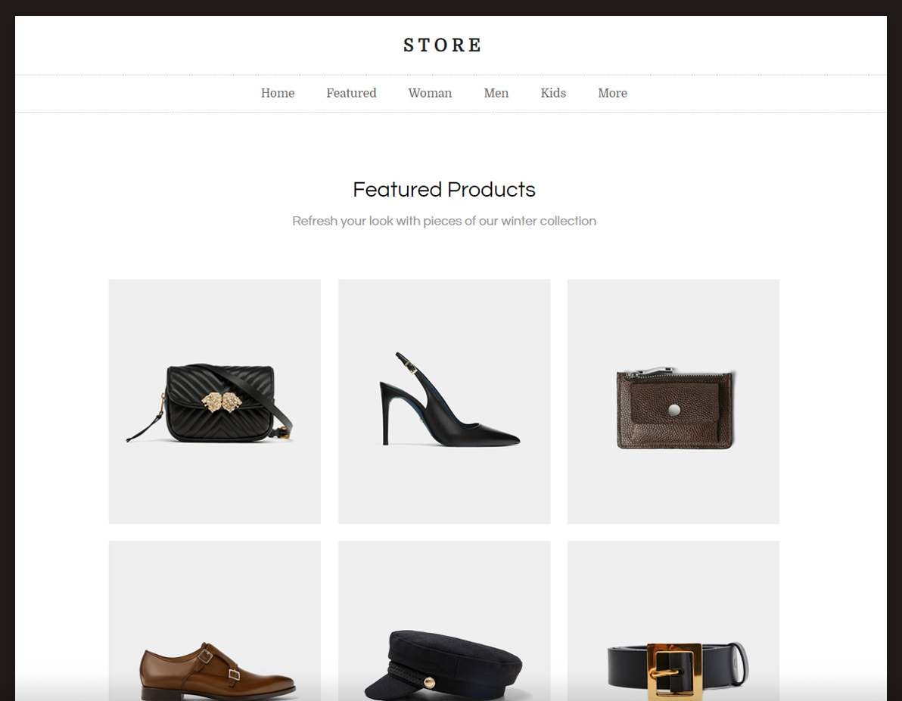

في هذا التحدي ستقوم ببناء شريط التنقل الخاص بالمتجر الذي قمنا بالعمل عليه سابقاً.

## مطلوب منك الوصول للنتيجة التالية:


## خطوات العمل: 
1- ستقوم بإضافة قائمة تحتوي على خمسة روابط:
```
home | featured | women | men | kids | more
```
2- ستقوم بعمل التنسيقات اللازمة عليها لجعلها مطابقة لما في الصورة أعلاة.

> لا يوجد أي قيود قم بإطلاق إبداعك بالإستفادة من كل ما تعلمناه سابقاً.

## تسليم الحلول

قم بتسليم أكواد مستند `index.html` و ملف `style.css`.

<a href="https://forums.coretabs.net/t/تسليم-حلول-مهمة-بناء-قائمة-المتجر/2047" class="task-btn">تسليم الحلول</a>

### تواجه تحديات في هذه المهمة؟
نحن متواجدين دائماً وتعرف أين تطرح إستفساراتك :wink: 

