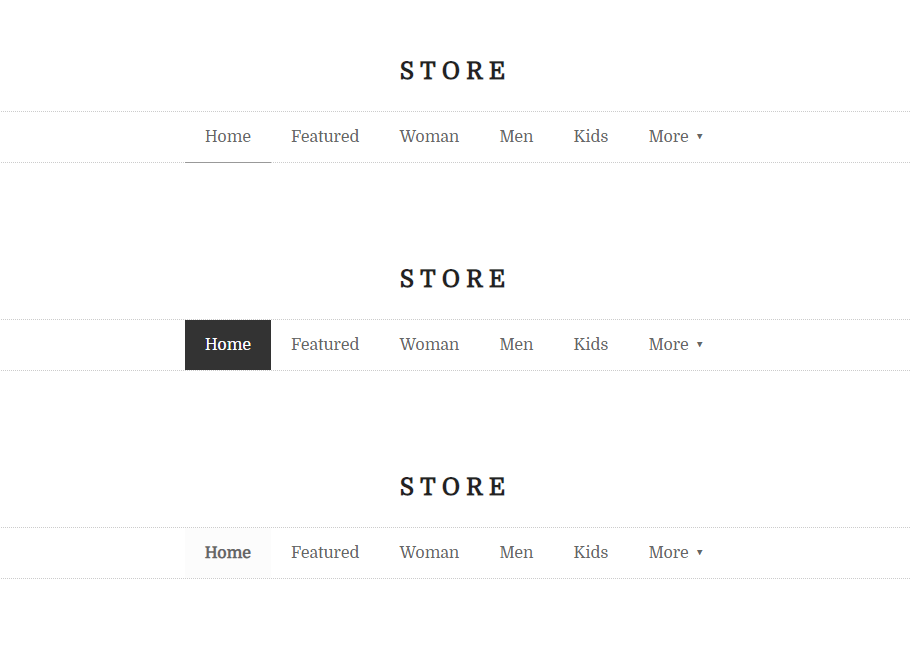

في هذه المهمة ستقوم بإضافة التنسيقات المميزة للرابط الفعّال في موقع المتجر.

## المطلوب منك:
باب الإبداع مفتوح، قم بإضافة التنسيقات التي تريد :grin:

**على سبيل المثال:**

> في حال واجهتك أي تحديات، أو قمت بإضافة تنسيقات ولم يتم تطبيقها على العنصر دعنا نقوم بمناقشة ذلك منصة المجتمع.

## ماهو المطلوب منك تسليمة:
يكفي نسخ الأكواد التي قمت بالتعديل عليها. أو الأكواد كاملة حسب ما تراه.

<a href="https://forums.coretabs.net/t/تسليم-حلول-مهمة-تمميز-الرابط-الفّعال/2127" class="task-btn">تسليم الحلول</a>